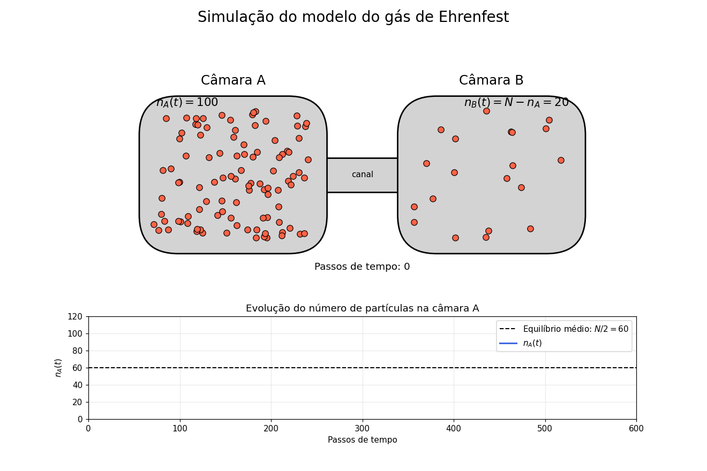

## Python_entropy
Este produto educacional constitui um dos resultados da dissertação de mestrado intitulada "EXPLORANDO AS DIVERSAS ABORDAGENS SOBRE ENTROPIA: UMA SEQUÊNCIA DIDÁTICA POTENCIALMENTE SIGNIFICATIVA", em execução desde 10/2024 com o apoio do MNPEF - Polo 67/UNIFAP, sob supervisão dos professores Dr. Robert Zamora e Dr. Marcelo Pires.

  

  Simulação computacional desenvolvida em Python para o estudo da entropia,
  do equilíbrio estatístico e das flutuações de partículas.

## Pré-requsitos
Para a utilização deste produto educacional, é necessário acessar o repositório no Github, e buscar o conteúdo desejado para visualização, e executá-lo através do ambiente disponibilizado no Google Colab, onde se faz necessário que o estudante possua uma conta Google.

## Como utilizar o Ambiente Digital
https://github.com/user-attachments/assets/fbfbd6c6-62aa-4db9-8ed4-c82a6d1f4a6c
